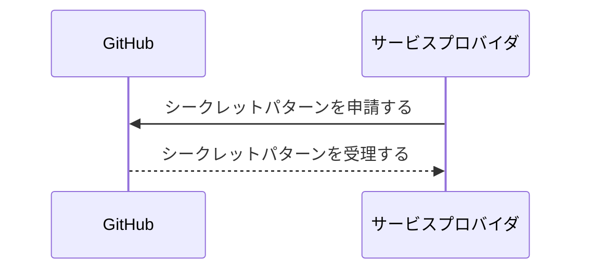
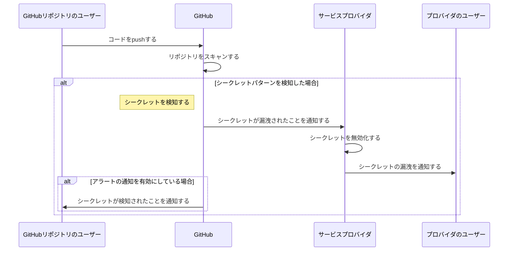
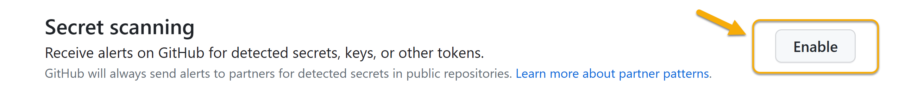
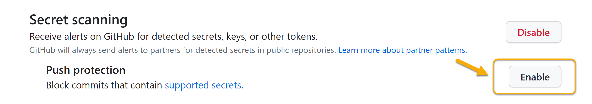
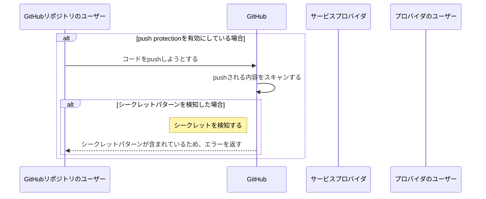

# GitHub Secret scanning's push protection demo

GitHub Secret scanningのpush protectionのデモリポジトリです。

## GitHub Secret scanningの解説

GitHub Secret scanningは、GitHub上にpushされたコードの中に、秘密情報が含まれていないかを検出する機能です。

検知される秘密情報のパターンは、パートナープログラムによって登録されたサービスプロバイダが提供するパターンのほか、ユーザーが独自に定義する（※）こともできます。（※カスタムパターンについては、[シークレット スキャンのカスタム パターンの定義](https://docs.github.com/ja/enterprise-cloud@latest/code-security/secret-scanning/defining-custom-patterns-for-secret-scanning)をご参照ください）

パートナープログラムでは、サービスプロバイダ（GitHub、Microsoft、Amazon Web Servicesなどのシークレットの発行元）がGitHubに対しシークレットパターンを申請することで、GitHub Secret scanningでそのシークレットパターンが検知・対処されるようになります。パートナープログラムによりサポートされるシークレットパターンについては、[サポートされているシークレット](https://docs.github.com/ja/code-security/secret-scanning/secret-scanning-patterns#supported-secrets)をご参照ください。

### シークレットが検知された場合の挙動

GitHub Secret scanningによりシークレットパターンが検知されると、GitHubはサービスプロバイダに対し、シークレットが漏洩されたことを通知します。サービスプロバイダは、シークレットを無効化するとともに、プロバイダのユーザーに対し、シークレットの漏洩を通知します。

#### アラートの通知を有効にしている場合

何も設定していない場合、シークレットの検知はGitHubのリポジトリの管理者に通知されませんが、リポジトリの設定で「Receive alerts on GitHub for detected secrets, keys, or other tokens.」を有効にしていれば、そのリポジトリの管理者へも通知されます。

### push protection（プッシュ保護）

アラートの通知を有効にした上で「Push protection」も有効にすると、`git push`を実行したとき、その内容がスキャンされ、シークレットパターンが検出された場合にpushを拒否できるようになります。

